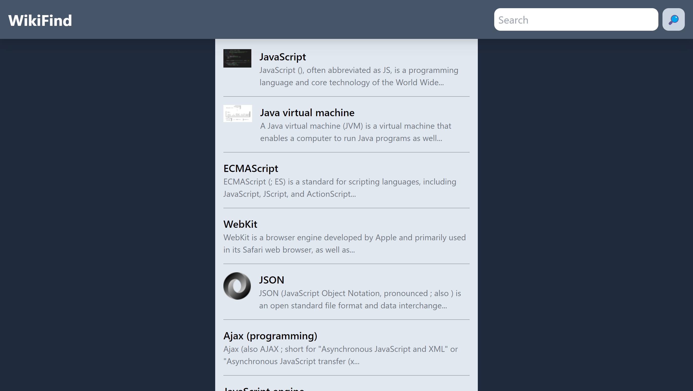

# WikiFind
## **About the Project**

A web application that returns Wikipedia data based on a given search query. This project was built with Next.js, TailwindCSS, and uses the official [Wikipedia API](https://www.mediawiki.org/wiki/API:Main_page) for data fetching.

## **Screenshot**
| Desktop | Mobile |
|:---:|:---:|
|  |   |